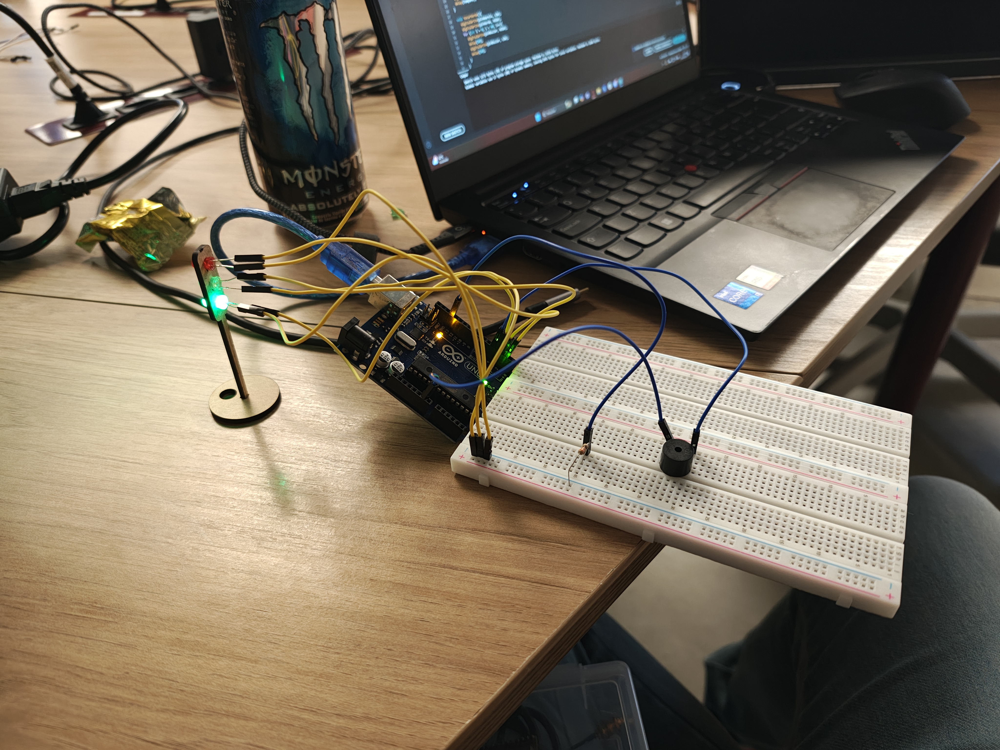

# Ponderada Semana3 Farol
 
## Video
&emsp;O vídeo se encontra no arquivo nesse repositório.

## Imagem



## Relato

&emsp;Seja por uma ideia boa ou por pura preguiça de conectar vários resistores no circuito, a ideia de utilizar apenas um veio do fato de que, nesse sistema, não há como queimar os leds com um resistor de 1k ohm conectado no ground, protegendo os leds.
<br>
&emsp;Cada led está conectado em um pino diferente e, pelo código, a função acenderLuz apaga a luz anterior, acende a nova e espera o tempo necessário até a próxima troca, seguindo o pedido.
<br>
&emsp;Além disso, o buzzer está conectado em outro pino, que começa a "bipar" durante o sinal verde, simulando um [semáforo australiano](https://www.youtube.com/watch?v=B0cz1XW9QvE&pp=ygUSc2VtYWZvcm8gYXVzdHJhbGlh)

## Materiais

| Componente  | Quantidade |
| ------------- | ------------- |
| Jumper MxF  | 6  |
| Jumper MxM  | 3  |
| Buzzer  | 1  |
| LED | 3  |
| Arduino  | 1  |
| Resistor 330 ohms  | 1  |

## Código

```cpp
int pinVerde = 4;
int pinVermelho = 2;
int pinAmarelo = 3;
int pinBuzzer = 5;
//Cria um array de pinos, que é utilizado no setup
int pins[4] = {pinVerde, pinVermelho, pinAmarelo, pinBuzzer};

void setup() {
  // put your setup code here, to run once:
  Serial.begin(9600);
  //Seta todos os pinos do array para OUTPUT, e desliga todos esses pinos
  for (int i = 0; i <4; i++){
    pinMode(pins[i], OUTPUT);
    digitalWrite(pins[i], LOW);
  }
}

void loop() {
  acenderLuz(pinAmarelo, pinVermelho, 6000);
  acenderLuz(pinVermelho, pinAmarelo, 2000);
  tocarVerde();
  acenderLuz(pinVerde, pinAmarelo, 2000);
}

//Função de acender a luz; Apaga a luz antiga, acende a nova e espera certo tempo até o próximo
void acenderLuz(int pinoAntigo, int pinoNovo, int tempoMs){
  digitalWrite(pinoAntigo, LOW);
  digitalWrite(pinoNovo, HIGH);
  delay(tempoMs);
}

//Desliga o amarelo, liga o verde e faz o buzzer piscar som
void tocarVerde(){
  digitalWrite(pinAmarelo, LOW);
  digitalWrite(pinVerde, HIGH);
  for (int i = 0; i < 40; i++){
    digitalWrite(pinBuzzer, HIGH);
    delay(50);
    digitalWrite(pinBuzzer, LOW);
    delay(50);
  }
}
```

## Avaliação

### Avaliador: Marcelo Rubim Rossignolli

| Critério                                                                                                 | Contempla (Pontos) | Contempla Parcialmente (Pontos) | Não Contempla (Pontos) | Observações do Avaliador |
|---------------------------------------------------------------------------------------------------------|--------------------|----------------------------------|--------------------------|---------------------------|
| Montagem física com cores corretas, boa disposição dos fios e uso adequado de resistores                | Até 3              | Até 1,5                            | 0                        |Cores corretas, 1; Fios parcialmente distribuídos corretamente 0,5, Resistores usados corretamente, 1; 2,5                           |
| Temporização adequada conforme tempos medidos com auxílio de algum instrumento externo                  | Até 3              | Até 1,5                          | 0                        |Temporização correta; 3                           |
| Código implementa corretamente as fases do semáforo e estrutura do código (variáveis representativas e comentários) | Até 3              | Até 1,5                          | 0                        |Código correto com suas variáveis e comentários explícitos; 3                           |
| Extra: Implmeentou um componente de liga/desliga no semáforo e/ou usou ponteiros no código | Até 1              |  Até 0,5                         | 0                        |Colocou um buzer para acessibilidade, ou seja, quando o sinal está verde é tocado um alarme para ajudar cegos a atravessarem; 1                           |
|  |                                                             |  | |**Pontuação Total: 9,5**|

### Avaliador: Nicolas Ramon da Silva
| Critério                                                                                                 | Contempla (Pontos) | Contempla Parcialmente (Pontos) | Não Contempla (Pontos) | Observações do Avaliador |
|---------------------------------------------------------------------------------------------------------|--------------------|----------------------------------|--------------------------|---------------------------|
| Montagem física com cores corretas, boa disposição dos fios e uso adequado de resistores                | Até 3              | Até 1,5                            | 0                      |  Resistores corretamente utilizados, cabos poderiam ter cores diferentes para + e -; 3,0                         |
| Temporização adequada conforme tempos medidos com auxílio de algum instrumento externo                  | Até 3              | Até 1,5                          | 0                        |  Tempo correto; 3,0                         |
| Código implementa corretamente as fases do semáforo e estrutura do código (variáveis representativas e comentários) | Até 3              | Até 1,5                          | 0            |  Código bem estruturado e comentado; 3,0                         |
| Extra: Implmeentou um componente de liga/desliga no semáforo e/ou usou ponteiros no código | Até 1              |  Até 0,5                         | 0                        | Cegos podem utilizar as ruas da cidade do cuca com o buzzer australiano; 1,0                        |
|  |                                                             |  | |**Pontuação Total: 9,5**|